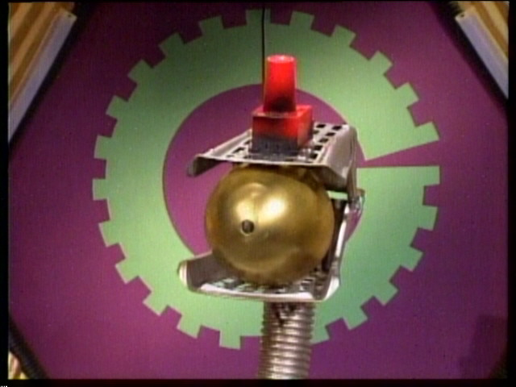

CamBot - Slack UniFi Video Camera Bot
*************************************

CamBot is a Slack bot for viewing snapshots from a UniFi Video Camera System.
It utilizes the NVR API interface to query and retrieve stills from cameras.

To start, you'll need to create an API key on the NVR, and a Slack API Token.

Usage
=====

Run the bot::

    export NVR_URL='https://172.17.0.1:7443'
    export NVR_API_KEY='XXXX'
    export SLACKBOT_API_TOKEN='xoxb-XXXX-XXXX'
    cambot

Installation
============

You'll need to create a Slack Bot and create a Slack Bot API Token, then::

    pip install cambot

Source
======
Github: https://github.com/ampledata/cambot

Author
======
Greg Albrecht oss@undef.net

http://ampledata.org/

Copyright
=========
Copyright 2017 Greg Albrecht

License
=======
Apache License, Version 2.0. See LICENSE for details.
